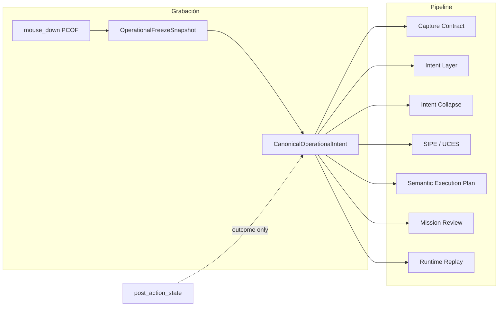

# Freeze-First Execution Core (FFEC)

## Ley universal

```text
IF operational_freeze_snapshot.pre_transition_confirmed
AND best_entity_candidate.confidence >= 0.90
AND NOT dynamic_surface_unsafe
AND NOT destructive_context
AND NOT ambiguity_critical:
    THEN freeze truth → CanonicalOperationalIntent (canonical_truth=True)
```

Desde ese momento:

| Prohibido | Motivo |
|-----------|--------|
| Recalcular identidad desde after_state | El humano actuó **antes** del cambio de UI |
| Downgrade por post-transición | COI fija `truth_strength` mínima |
| Ambigüedad legacy / ask fallback | `legacy_runtime_contamination_guard` |
| Coords-first | Solo `absolute_coords_emergency` |
| Reabrir intent ambiguity | Intent layer fuerza `accept` si hay COI |

**After state** solo valida outcome (`transition_observed`), nunca define target.

---

## Arquitectura



---

## Módulos nuevos

| Archivo | Rol |
|---------|-----|
| `app/contracts/mission.py` | `CanonicalOperationalIntent`, enums de política |
| `app/services/missions/freeze_first_execution_core.py` | Promoción, política global, patch post-action |
| `app/services/missions/legacy_runtime_contamination_guard.py` | Muro anti-contaminación legacy |

---

## Flujo Freeze → Canonical Intent → Replay

1. **mouse_down** — `begin_pre_click_freeze` (PCOF).
2. **mouse_up / click** — `finalize_pre_click_freeze` → `OperationalFreezeSnapshot`.
3. **FFEC** — `promote_freeze_to_canonical_intent` → metadata + `mission.canonical_operational_intents`.
4. **Capture contract** — `build_capture_contract(..., canonical_operational_intent=...)` cierra `capture_complete` con verdad PRE.
5. **Intent layer** — si COI activo: `intent_decision=accept`, sin ask.
6. **Post-action** — `patch_capture_contract_after_post_action` no invalida identidad; marca `transition_observed`.
7. **SIPE / UCES** — `select_entity_from_collection` con `selection_strategy=pre_click_operational_freeze`.
8. **Runtime** — prioridad: COI → UCES → ERL → LONE → UIA → OCR → Vision → coords emergencia.

---

## Integraciones (archivos modificados)

- `app/services/missions/recorder.py` — promoción post-PCOF; FFEC en append; post-action seguro.
- `app/services/missions/recorder_capture_contract.py` — rama FFEC en `build_capture_contract`.
- `app/services/missions/execution_truth_engine.py` — COI como EXECUTION_TRUTH primario.
- `app/services/missions/semantic_intent_promotion_engine.py` — filtro de blockers legacy.
- `app/services/missions/intent_collapse_engine.py` — no emite `select_profile` vacío si COI/PCOF fuerte.
- `app/services/missions/semantic_review_display.py` — más strings ocultos en vista normal.
- `app/services/runtime/universal_collection_entity_engine.py` — `should_promote_pcof_freeze` alineado con gates FFEC.

---

## Legacy aislado (no eliminado)

Siguen existiendo para **modo experto / debug** pero el guard los bloquea cuando hay COI:

- `select_profile`, `uia_text_match`, `click_visual`, `smart_route`
- `CandidateFusionEngine` ask/confirm sobre after_state
- Recompute agresivo de `capture_complete` solo por falta de `post_state`
- Coords en grafo compilado legacy

---

## Mission Review (vista normal)

- Pasos desde SEP/SIPE con `human_label` (Abrir Chrome, Seleccionar perfil, …).
- Sin: `uia_text_match`, `smart_route`, `capture_score`, coords, % confianza.
- Con COI: mensajes tipo «Elemento identificado automáticamente» / «Acción lista para ejecutarse».

---

## Criterio de éxito runtime

Nevlan ejecutó bien si:

- `intended_entity_reached` **y**
- `expected_transition_happened`

No si `pixel_matched`.

---

## Tests

- `tests/unit/test_freeze_first_execution_core.py`
- Existentes PCOF/SEP: `tests/unit/test_pcof_to_sep_integration.py`

---

## Riesgos honestos

1. **Confianza 0.90** — clicks en superficies muy dinámicas sin entidad clara no promueven (by design).
2. **Colecciones ruidosas** — `ambiguity_critical` bloquea si hay varios candidatos sin dominancia PCOF.
3. **Intent layer legacy** — override en recorder; otros callers de fusion sin COI en metadata pueden seguir preguntando.
4. **Misiones antiguas** — sin `canonical_operational_intents` en JSON; FFEC solo en grabaciones nuevas con PCOF activo.
5. **Runtime executor** — prioridad COI documentada; rutas coords del SmartExecutor aún requieren guard explícito en ejecución (fase siguiente).

---

## Caso Daniel Chrome (esperado)

Mission Review normal:

- Abrir Chrome  
- Seleccionar perfil  
- Abrir nueva pestaña  
- Abrir YouTube  
- Buscar contenido  
- Desplazar resultados  

Sin: needs clarification, profile missing, uia_text_match, coords, low confidence.
